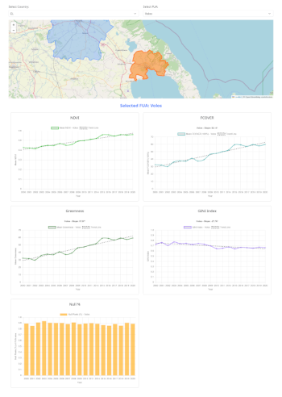

# European cities are greening and access to greenspace becomes more equal

This repository is supplementary to the manuscript of "*European cities are greening and access to greenspace becomes more equal*".

## Contents

The *source* directory contains the primary Jupyter notebooks responsible for data preprocessing.

- *source/1_ndvi.ipynb* performs processing of Landsat imagery, computes the Normalized Difference Vegetation Index (NDVI), and derives NDVI percentiles aggregated at the NUTS II spatial resolution.

- *source/2_applyCorrection.ipynb* computes fractional vegetation cover (fcover) and greenness indices, and integrates greenness with population datasets to generate input features for GINI coefficient estimation.

The output/tables directory stores the resulting data tables:

- *output/tables/GINI_population.csv*: Tabulated GINI coefficients, population counts, and T10/B10 ratio metrics by Functional Urban Area (FUA) and year.

- *output/tables/greeness.csv*: Mean greenness values aggregated per FUA and year.

- *output/tables/NDVI.csv*: Mean NDVI values aggregated per FUA and year.

Also, a webpage of the results is available at: https://kokkytos.github.io/greenness_eu/

